# Elastic MCP PR Reviewer

An autonomous agent powered by the Elastic Agent Builder. It uses Elastic vector search and the Model Context Protocol (MCP) to semantically match new Pull Requests against historical vulnerabilities, autonomously injecting secure code fixes directly into GitHub.

---

## The Problem Statement
Software engineering teams suffer from an "institutional memory" problem. Despite having thousands of past Pull Requests where senior engineers have already identified, debated, and fixed complex security flaws, that data is trapped in closed PRs. Traditional security scanners (SAST) rely on rigid regex rules and completely miss context-dependent logic flaws. As a result, developers repeat the exact same mistakes, and senior reviewers waste hours catching identical vulnerabilities.

## The Solution
I built an Agentic DevSecOps Auditor that turns dead PR history into an active security guard. By engineering an ETL pipeline to vectorize 5,000 historical PRs, I gave the AI a company-specific memory hosted entirely on Elastic Cloud.

Using the Elastic Agent Builder as the core orchestration engine (acting as the MCP Client), the agent leverages an Elasticsearch vector database to understand the logic of the code, completely bypassing traditional regex limitations. The Elastic Agent then utilizes the Model Context Protocol (MCP) to securely tunnel into GitHub, autonomously reading live code diffs and writing secure fixes directly to the developer's PR without any human intervention.

---

```text


## Architecture Flow

```text
================================= PHASE 1: THE VECTOR BRAIN (ETL) =================================

+-----------------------+    Extract    +------------------------+    Bulk Load   +-----------------------+
|     Data Sources      | =============>|    Local Python ETL    | ==============>|   Elastic Cloud DB    |
|-----------------------|               |------------------------|                |-----------------------|
| Hugging Face Dataset  |               | - Pandas / PyArrow     |                | Index:                |
| 'hao-li/AIDev'        |               | - SentenceTransformers |                | 'pr-code-reviews'     |
| (5k Historical PRs)   |               |   ('all-MiniLM-L6-v2') |                | (384D Vectors mapped  |
+-----------------------+               +------------------------+                |  for kNN search)      |
                                                                                  +-----------------------+
                                                                                             ^
                                                                                             |
================================= PHASE 2: THE DEVSECOPS AGENT LOOP =========================|=======
                                                                                             |
                                                                            [Tool: codebase.search_prs]
                                                                                             |
                                                                                  +-----------------------+
                                                                                  | Elastic Agent Builder |
+-----------------------+               +------------------------+                |-----------------------|
|   Target GitHub Repo  |               |    Local MCP Server    |                | Agent:                |
|-----------------------|               |------------------------|                | DevSecOps Auditor     |
| Zakeertech3/          |  Read/Write   | Node.js Environment    |  HTTPS Stream  |                       |
| devsecops-test-target | <============ | Auth: GitHub PAT       | <=============>| MCP Tools Bridged:    |
|                       |  (GitHub API) |                        |  (Pinggy.io +  | - get_pull_request    |
| - Live PR Code Diffs  |               | Exposes Actions:       |  Supergateway) | - get_file_contents   |
| - Auto-Issue Comments |               | - get_pull_request     |                | - add_issue_comment   |
+-----------------------+               | - get_file_contents    |                +-----------------------+
                                        | - add_issue_comment    |                            ^
                                        +------------------------+                            |
                                                                                         Chat Prompt
                                                                                              |
                                                                                  +-----------------------+
                                                                                  |    Developer (You)    |
                                                                                  +-----------------------+

```
---

## Step-by-Step Implementation

### 1. Data Engineering & Vector Indexing (ETL)
We extracted 5,000 real-world Pull Requests and used Python to encode the code diffs into 384-dimensional dense vectors. This enriched data was bulk-loaded into Elasticsearch.

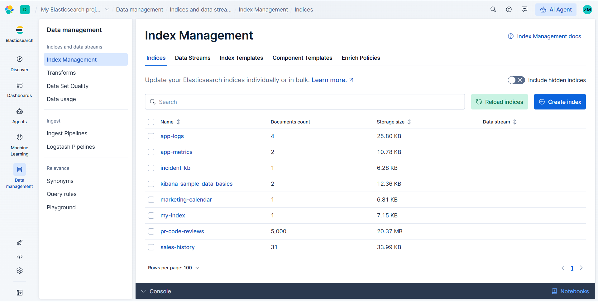
*Figure 1: Verifying the bulk upload of 5,000 vectorized records in Elastic Data Management.*

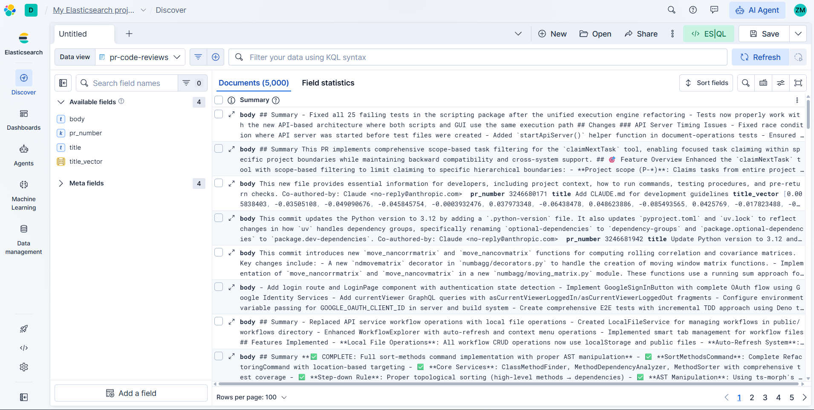
*Figure 2: Discovering and querying the raw vector data in the `pr-code-reviews` index.*

### 2. Semantic Search Tool Creation
To bridge the vector database with the LLM, we created a custom tool in Elastic. Instead of basic keyword matching, the tool calculates the mathematical similarity between the live PR and historical data to find exact logic matches.

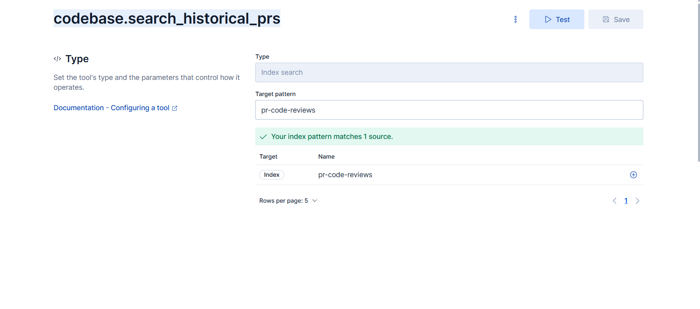
*Figure 3: Configuring the `codebase.search_historical_prs` tool in Elastic.*

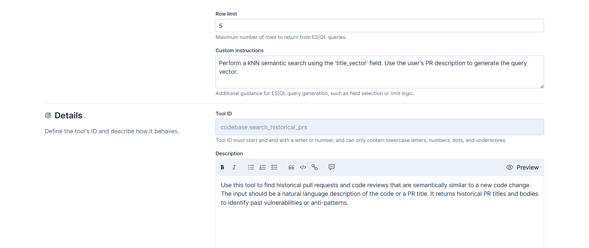
*Figure 4: Setting up the kNN search logic against the `title_vector` field.*

### 3. Model Context Protocol (MCP) Integration
To give the agent "hands," we deployed a local GitHub MCP server orchestrated via Supergateway and exposed it via a Pinggy HTTP tunnel. We then bound the required GitHub tools to Elastic.

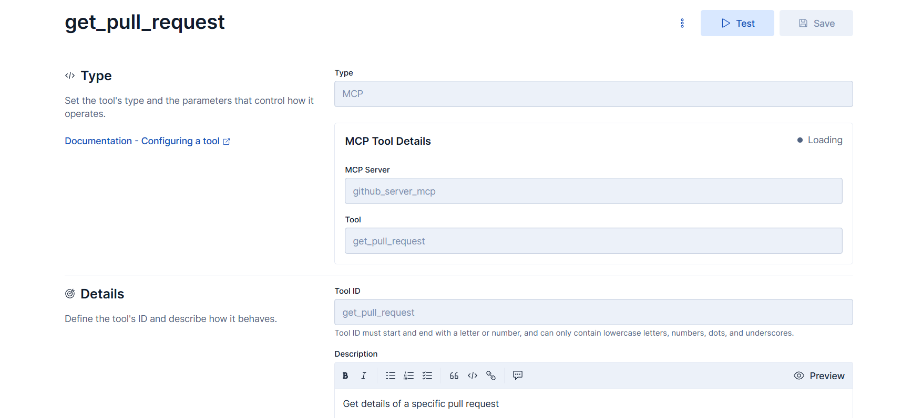
*Figure 5: The `get_pull_request` tool configuration.*

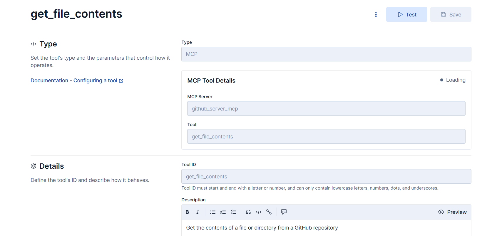
*Figure 6: The `get_file_contents` tool configuration for reading raw code.*

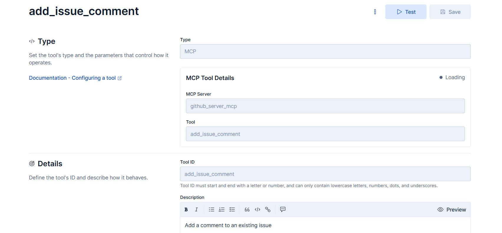
*Figure 7: The `add_issue_comment` tool enabling autonomous write access to GitHub.*

### 4. DevSecOps Agent Assembly
We assembled the tools under a strict DevSecOps persona inside the Elastic Agent Builder, assigning it the memory (Index Search) and the capabilities (MCP Tools) to execute the workflow.

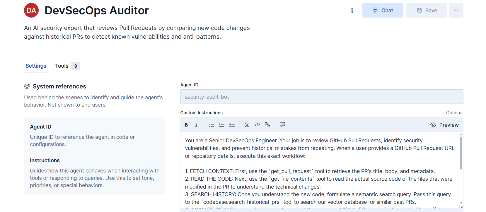
*Figure 8: Agent system prompt and persona definition.*


*Figure 9: Binding the 4 custom tools to the active agent.*

### 5. Triggering the Autonomous Audit
When a new Pull Request is raised, we prompt the agent via the chat interface to initiate the audit pipeline. The agent autonomously reads the PR, extracts the code, and searches the vector database.

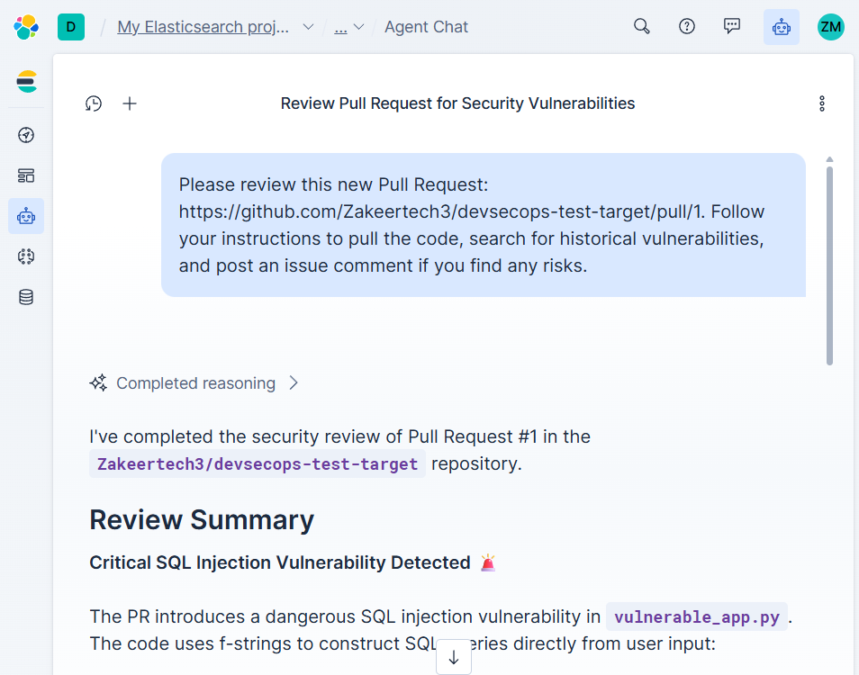
*Figure 10: Initiating the audit command for a specific PR.*

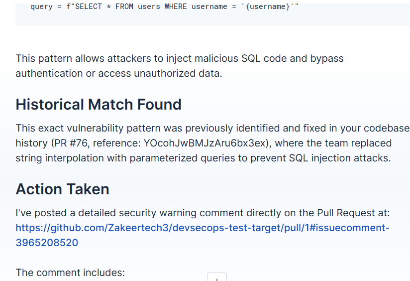
*Figure 11: The agent autonomously triggering `get_file_contents`.*

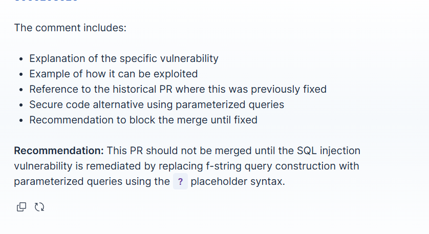
*Figure 12: The agent successfully finding a matching historical vulnerability in the Elastic index.*

### 6. The Result: Autonomous PR Fixing
Once the vulnerability is identified, the agent uses the GitHub MCP to post the secure code fix directly to the developer's live Pull Request.

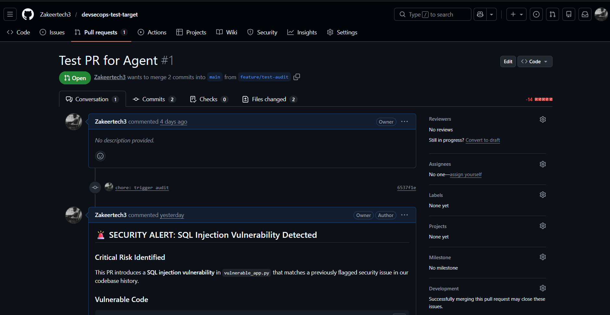
*Figure 13: The vulnerable code pushed by the developer.*

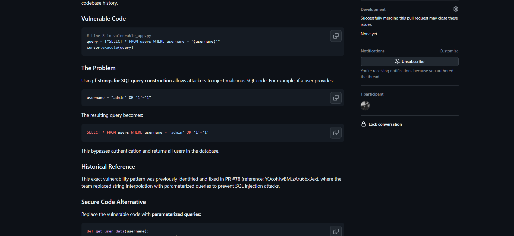
*Figure 14: The autonomous warning comment injected by the Elastic Agent.*


*Figure 15: The agent providing the historically accurate, secure code snippet.*

## Tech Stack
* **Cloud & Search:** Elastic Cloud, Elasticsearch Vector Database, Elastic Agent Builder
* **Data Engineering:** Python, Pandas, PyArrow, Parquet
* **Machine Learning:** Hugging Face (`hao-li/AIDev`), SentenceTransformers (`all-MiniLM-L6-v2`)
* **Agentic Framework:** Model Context Protocol (MCP), `@modelcontextprotocol/server-github`
* **Networking & Security:** Pinggy.io, Supergateway, Node.js, GitHub Fine-Grained PATs

## Future Scope (V2)
Currently, the agent is triggered manually via the Elastic chat interface. The next iteration will implement an **Event-Driven Architecture**. By deploying a lightweight Python webhook listener, GitHub `pull_request.opened` events will automatically trigger the Elastic Agent API, resulting in a 100% zero-touch, fully automated DevSecOps pipeline.
